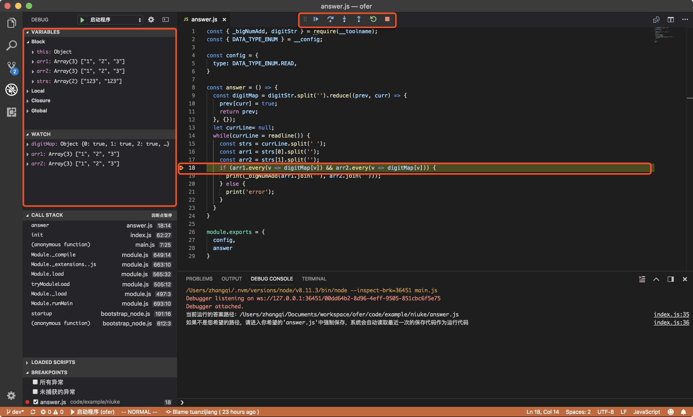
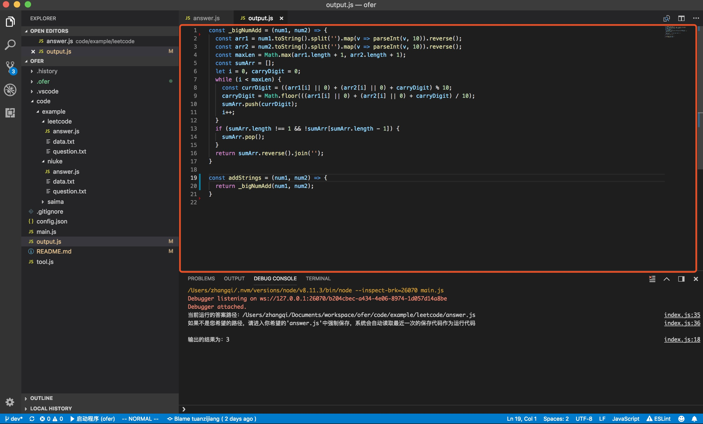
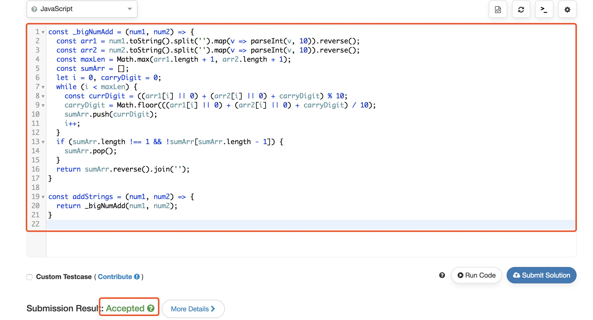
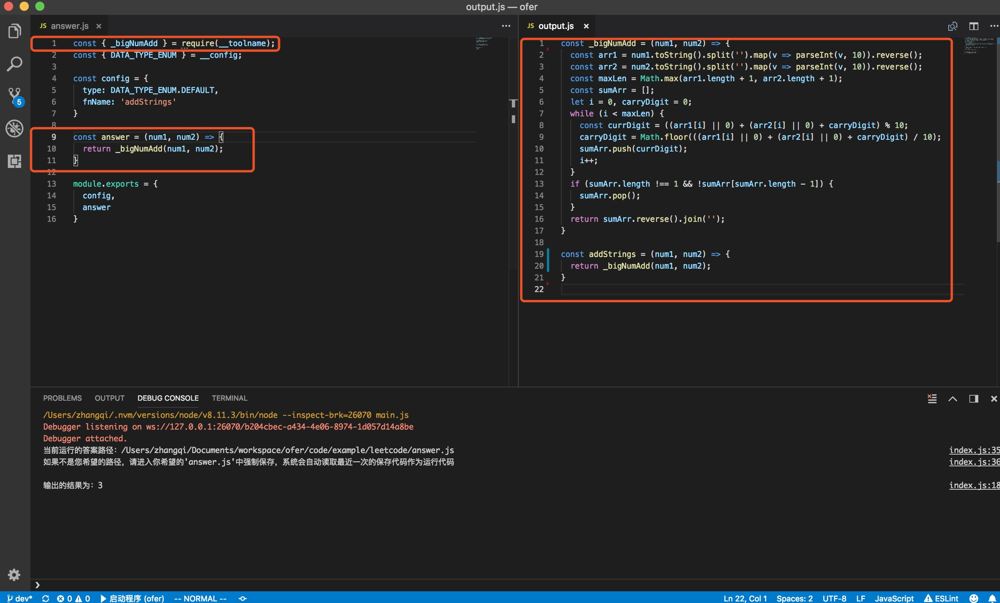
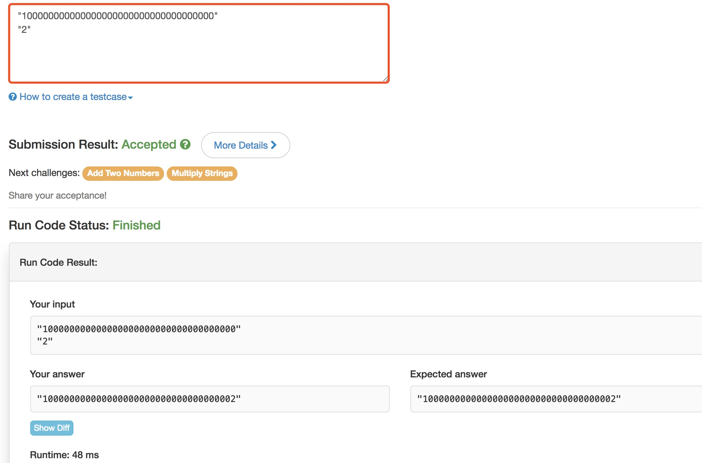
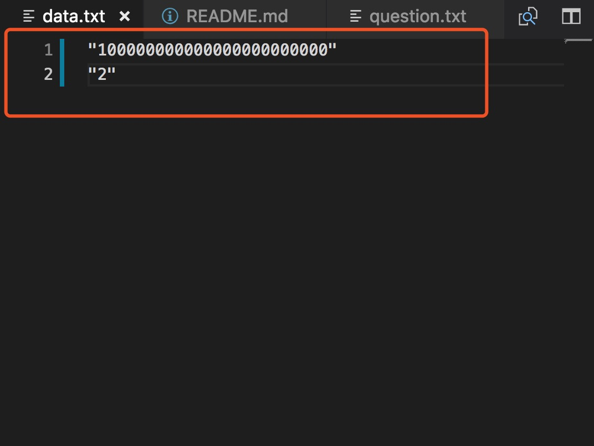
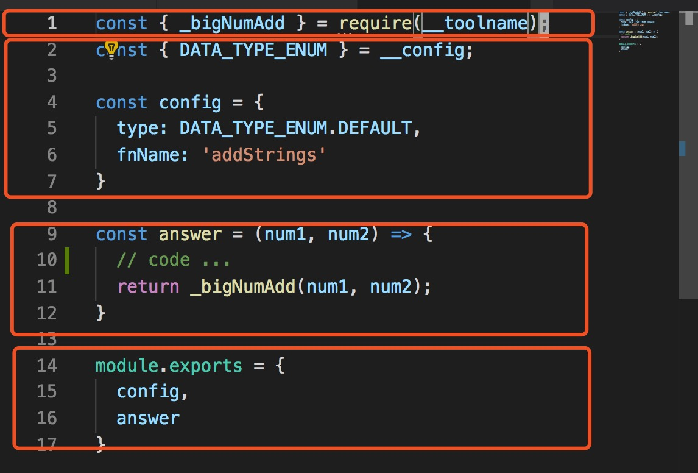

# Ofer
## 介绍
这是一款用于本地调试‘js在线编程题’（如：[leetcode](https://leetcode-cn.com/problemset/all/)、[牛客网](https://www.nowcoder.com/activity/oj)、[赛码网](http://www.acmcoder.com/index)等）的实用工具

## 功能与特性
#### 1. 支持本地断点调试


#### 2. 调试后自动生成输出文件，可以直接在“在线编程”网站运行
导出的文件：


运行的结果：


#### 3. 会对答案中的特定依赖项按调用顺序进行合并打包

左侧在```answer```中使用了```_bigNumAdd```，在输出文件中会将```_bigNumAdd```一同导入

tips: 
做题前可以预先准备好一些常用的函数并导入本系统
做题时可以直接使用，系统会根据依赖进行打包

#### 4. 支持对题目进行管理
在code目录下任何一个含有```answer.js```和```data.txt```的文件夹均可以当成一个题目。系统会读取**最新保存**的```answer.js```和其对应的```data.txt```进行运行。除此之外，你可以根据自己的喜好组织目录结构，也可以添加诸如```question.txt```的文件对题目和思路进行记忆，方便后续查找。

#### 5. 操作简单
写题目需要操作的文件仅有两个```data.txt```和```answer.js```:
##### 对于```data.js```文件：

直接将'在线编程平台'的测试用例直接导入即可


**原封不动地复制粘贴**到对应的```data.txt```即可


##### 对于```answer.js```文件：

从上到下有四个部分：
1. 导入的外部依赖（可选）
2. 配置文件（必要）：
   - 读取data的格式（如：通过readline()读入，通过参数的方式读入等）
   - 配置导出的函数的名字（可选）
3. 填写的答案（必要）：真正答案输入的地方
4. 模块导出（必要, 无需更改）
